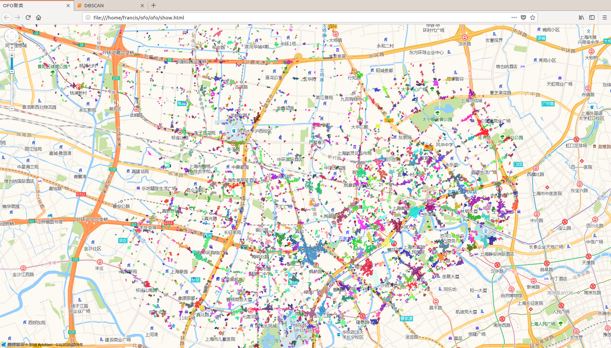
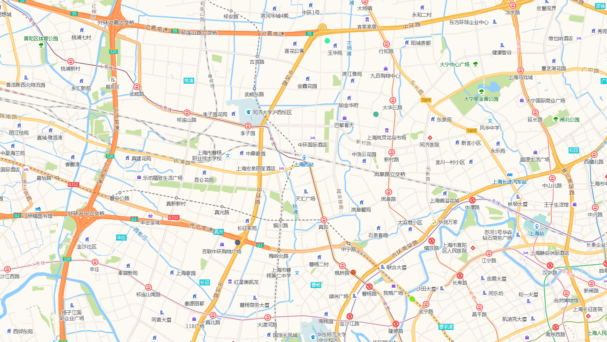

# ofo 数据分析
## 潜在高需求区域检测

### 算法描述

首先要明确已有的数据以及完成的目标，在爬虫得到的结果中，每一条记录包含着一个车辆的停放记录 **（经度lng，纬度lat，时刻time）**，而我们的目标是检测是否存在区域在以下情况：

* 在时刻1时 **没有** 车辆停放
* 在时刻2时 **有** 车辆停放
* 在时刻3时 **没有** 车辆停放
* 时刻1,2,3是相邻的连续时刻
* 以上情况频繁发生

如果存在以上情况的话，我们可以认为这个区域有着高需求量，但在车辆规划上没有满足这个区域的需求，即我们需要找的区域。

接下来考虑如何检测这样的区域，我们给出了如下步骤：

>1. 首先对车辆停放的坐标进行聚类，从而描述“区域”这个属性。
>2. 将坐标映射为区域：(lng,lat,time) => (area,time)
>3. 对相同区域的记录reduceByKey：(area,time)=>(area,[time0,time0,time1,...])
>4. time列表排序去重:(area,[time1,time0,time1,...])=>(area,[time0,time1,...])
>5. 检测time列表存在多少个时刻t[i]满足: t[i] - t[i-1] < △t and t[i+1] - t[i] < △t 
>6. 统计各区域满足上述情况是时刻数，按照此数量对area进行排序，输出最高m个area即为前m的潜在高需求区域

### 数据处理

确定算法之后，开始对数据进行处理，首先要明确的是数据集的大小。为了提高精度，我们的爬虫数据（仅普陀区）一天的存储量即有1G左右，如果使用一周的数据，就有7G，这还仅仅是一个区的数据。为了提高算法的可扩展性，我们选择用分布式计算的方式使用 **Spark** 系统 来实施这个方案。

1.原始数据格式
> 121.37046056865145,31.247071877948088,2018-08-01-11-15-34
> 
> 121.37045076705685,31.247133476503656,2018-08-01-11-15-34
> 
> 121.3712632021411,31.246282194261692,2018-08-01-11-15-34
> 
> ...

2.Spark对相同坐标去重
```scala
val data = sc.textFile("hdfs://127.0.0.1:9000/user/root/ofo")
val lnglat = data.map(text =>text.split(","))
            .map(tup => (tup(0)+","+tup(1),1))
            .reduceByKey((x:Int,y:Int)=>x+y)
lnglat.saveAsTextFile("/user/root/ofo_result")
```
得到结果的格式：
> (121.41933502561362,31.25399581502158,75)
> 
> (121.45243862029442,31.275210668310265,12)
> 
> (121.42130433325113,31.2414552813612,17)

3.对坐标进行聚类，划分区域。

在这里要讨论使用什么样的方法进行聚类？常用的聚类方法有Kmeans，DBSCAN,GMM等，但是在我们的场景中，有两个很重要的特性是：不能手动指定聚类数量K，存在大量噪声点。因此 **DBSCAN** 是一个比较合适的选择。

第二个需要讨论的事情是，DBSCAN也要拿到Spark里跑吗？Spark的MLlib里没有提供DBSCAN的工具包，主要原因是DBSCAN在计算每个点的分类时，几乎要和其他所有的点计算距离，这样存在了大量shuffle的操作，分布式效率极低。但是由于我们的数据是二维的平面坐标且使用欧式距离，所以可以考虑用一个合理的分区方法，对不同的地理区域进行局部的聚类，再对各个局部的聚类进行全局的汇总。但是在目前的情况下，对普陀区的一周的点进行汇总后发现大概只有10MB左右大小，完全没必要使用分布式的方法（还不足一个Block的大小），**因此我们将坐标点使用单机的Python程序进行聚类**。

> 聚类程序：[./DBSCAN.py]

4.聚类结果可视化

其中每一个颜色代表了一个聚类区域，选择的参数有：eps=20(meters)、minPos=4

5.检测区域
```scala
val data = sc.textFile("hdfs://127.0.0.1:9000/user/root/ofo")
val lnglat_time = data.map(text =>text.split(","))
            .map(l => (l(0)+","+l(1),l(2)))
//读取用于分类的map文件
val mapFile = Source.fromFile("hashmap")
var hashMap : Map[String,Int] = Map()
for(line <- mapFile.getLines) {
    val kv = line.split("-")
    hashMap = hashMap + (kv(0)->kv(1).toInt)
}
//坐标映射分区
val area_times = lnglat_time.map(x => if (hashMap.contains(x._1)) (hashMap(x._1),x._2) else (0,x._2))
                            .groupByKey
                            .map(x=>(x._1,x._2.toList.distinct.sorted))
//检测孤立区域

// 比较时间差
def timeDiff(x:String,y:String):Int = {
    val xl = x.split('-')
    val yl = y.split('-')
    (yl(2).toInt - xl(2).toInt)*24*60 +
    (yl(3).toInt - xl(3).toInt)*60 +
    (yl(4).toInt - xl(4).toInt)
}

// 检测孤立点
def detect(x:List[String]):List[String] = {
    var result:List[String] = List()
    if (x.size < 3)
        result
    else
        for (i <- 1 to (x.size -2)) 
            if (timeDiff(x(i),x(i+1)) > 30 && timeDiff(x(i-1),x(i)) > 30)
                result = x(i) +: result
        result 
    result
}
// 设置排序方式 按列表长度排序
implicit val sortBySize = new Ordering[List[String]]{
    override def compare(a:List[String],b:List[String]) = 
        a.size.compare(b.size)
}

//计算保存
val result = area_times.map(x => (detect(x._2),x._1)).sortByKey(false).map(x => (x._2,x._1)).filter(x => x._2.size > 1)
result.saveAsTextFile("/user/root/ofo_final")
     
```

6.检测结果(仅包括两天的)
```
(121.38823388842907,31.245841501274622,List(2018-10-02-12-18-16, 2018-10-02-10-57-47, 2018-10-02-09-37-23, 2018-10-01-22-54-52, 2018-10-01-21-54-35, 2018-10-01-20-54-24, 2018-10-01-12-32-44))
(121.4196889357396,31.270805887301474,List(2018-10-02-08-37-05, 2018-10-02-07-56-53, 2018-10-01-20-54-24, 2018-10-01-18-54-05, 2018-10-01-16-33-38))
(121.40867135089297,31.285115335117897,List(2018-10-02-12-38-17, 2018-10-02-09-37-23, 2018-10-01-19-34-11, 2018-10-01-15-33-21, 2018-10-01-13-52-57))
(121.41457789374273,31.24008780361251,List(2018-10-02-08-17-00, 2018-10-02-06-36-39, 2018-10-01-21-54-35, 2018-10-01-20-14-18))
(121.42791242751068,31.234859428005784,List(2018-10-01-20-14-18, 2018-10-01-18-34-03, 2018-10-01-15-53-27))
...
```
7.结果可视化

